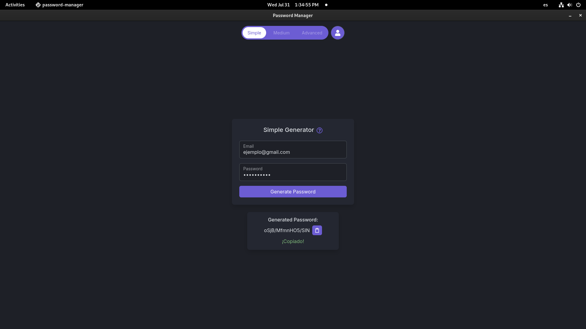
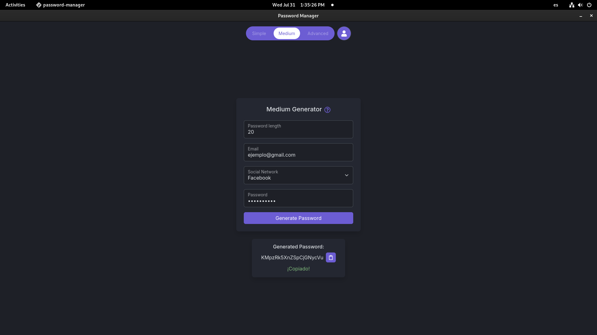
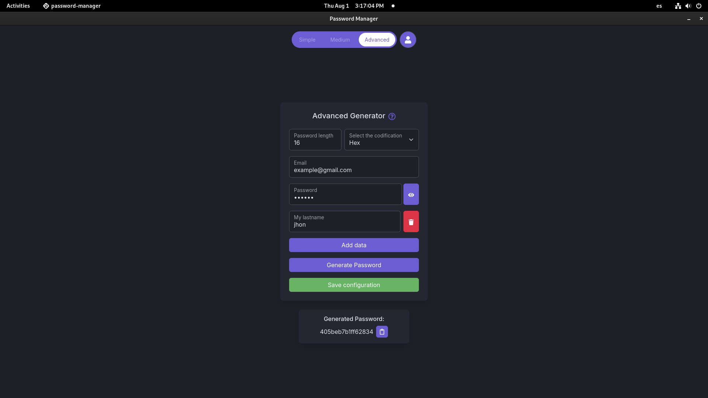
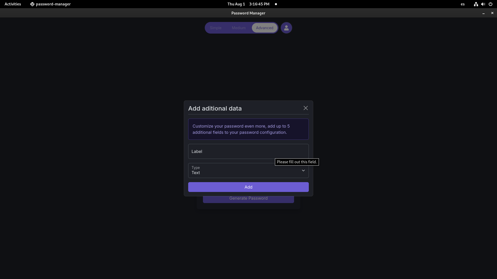
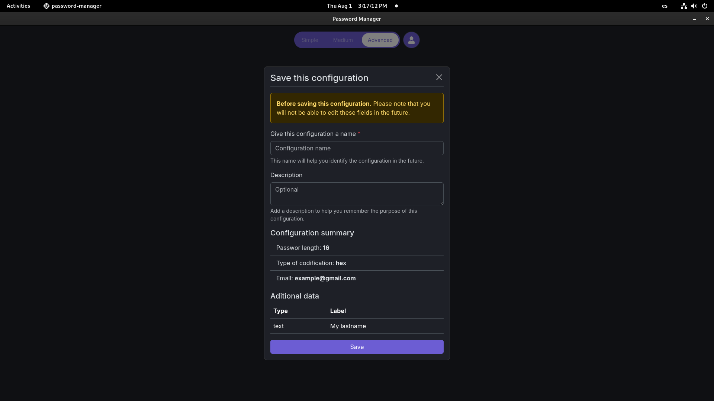

# Password Manager

## Descripción

Esta es una herramienta que permite generar contraseñas seguras de manera sencilla, media y avanzada. Proporciona flexibilidad para ajustar diferentes parámetros de seguridad y formatos de codificación.

## Características

- **Simple Generator**: Genera contraseñas básicas con solo ingresar un correo electrónico y una contraseña maestra.
- **Medium Generator**: Permite ajustar la longitud de la contraseña y seleccionar la red social para la cual se está generando la contraseña.
- **Advanced Generator**: Ofrece opciones avanzadas para personalizar la longitud, codificación y otros parámetros de seguridad.

## Capturas de Pantalla

### Generador Simple

### Generador Medio

### Generador Avanzado

## Uso

### Instalación

1. Clona el repositorio:

`git clone https://github.com/JorgeMike/passwordManager.git`

2. Navega al directorio del proyecto:

`cd password-manager`

3. Instala las dependencias:

`npm install`

### Ejecución

Para iniciar la aplicación, ejecuta:

`npm start`

### Uso del Generador de Contraseñas

1. **Generador Simple**:

   - Ingresa tu correo electrónico y una contraseña maestra.
   - Haz clic en "Generate Password".

2. **Generador Medio**:

   - Ajusta la longitud de la contraseña.
   - Ingresa tu correo electrónico y selecciona la red social.
   - Ingresa una contraseña maestra.
   - Haz clic en "Generate Password".

3. **Generador Avanzado**:
   - Ajusta la longitud de la contraseña.
   - Selecciona la codificación (Base64, Hex, Binary).
   - Ingresa tu correo electrónico y una contraseña maestra.
   - 🚧 En desarrollo 🚧

# Update

